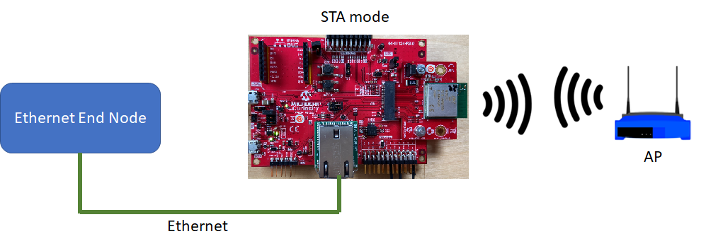
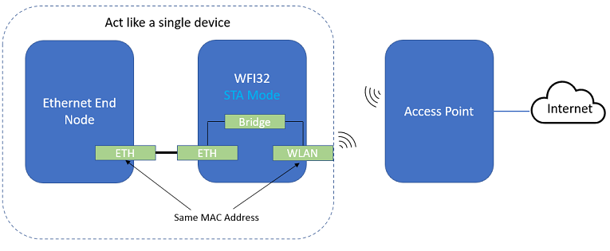
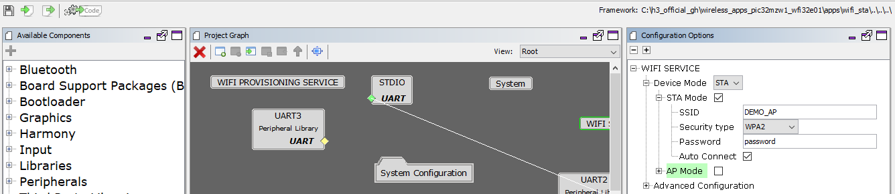
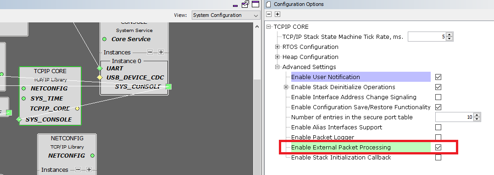
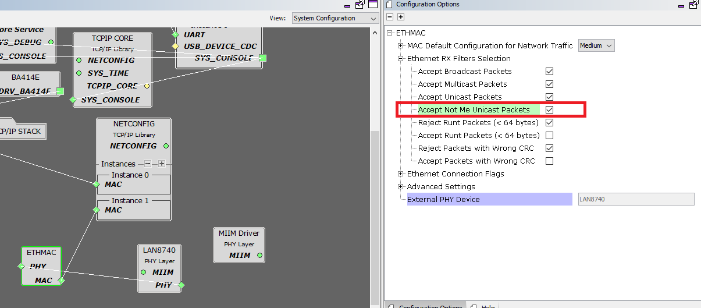
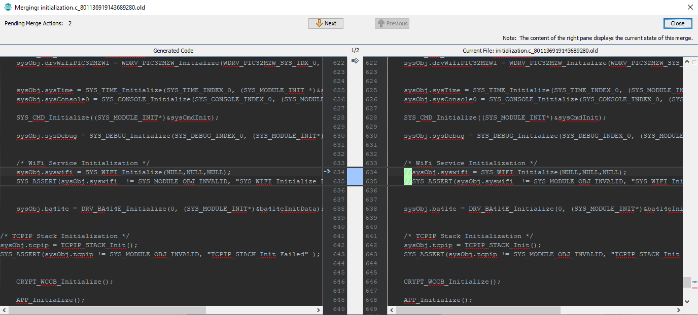
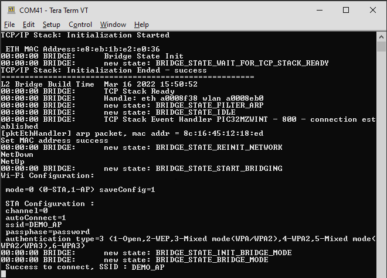
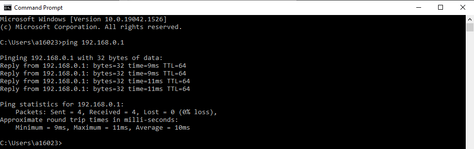

# Ethernet WiFi Bridge For Ethernet End Node (WFI32 running as STA mode)

> "Wireless Made Easy!" - This example application acts as a bridge to bridge up WiFi and ETH interface of WFI32 device, WFI32 set as Wi-Fi Station(STA) mode to connect to Access point(AP). The WFI32 device help connect ETH end node to the Access point (AP) in this example.

Devices: **WFI32E01**

## Description

This application demonstrates how a ETH end node can connect to a WiFi network through WFI32 device. The WFI32 device is set as Wi-Fi Station (STA) mode to connect the Accesss point (AP) and act as a Wi-Fi ETH bridge to bridge up the Wi-Fi and Ethernet interface. In the setup, ETH end node connect to the Ethernet connector of WFI32 device and exchange data with the Access Point through the WFI32 device. The user would need to configure the Home AP credentials (like SSID and security items). The Wi-Fi service running on WFI32 device will use the credentials to connect to the Home AP.The default application will try to establish a connection to AP "DEMO_AP" with WPA2 security and password as a "password".

This project process the IP packets that received from the Wi-Fi and ETH interface at bridge.c. The code in this file act as a transparent bridge to receive and forward the network packets to and from both Wi-Fi and ETH interface. It set the mac address of WFI32 to be the same as Ethernet end node so that the Ethernet end node can communicate with the AP. As both Ethernet end node and WFI32 are using the same mac address, they are acting as a single unit in the network.

The H3 L2 Bridge feature is not used in this project

## Software requirement

The sample project has been created and tested with the following Software Development Tools:
- [MPLAB X IDE v5.50](https://www.microchip.com/en-us/tools-resources/develop/mplab-x-ide)
- [MPLAB XC32 v3.01](https://www.microchip.com/en-us/tools-resources/develop/mplab-xc-compilers)
- MPLAB Harmony v3.6.4
   - mhc v3.8.2
   - csp v3.10.0
   - core v3.10.0
   - wireless_wifi v3.7.0 (release soon)
   - dev_packs v3.10.0
   - wireless_system_pic32mzw1_wfi32e01 v3.6.1
   - wolfssl v4.7.0
   - net v3.7.4
   - crypto v3.7.4
   - CMSIS-FreeRTOS v10.3.1

Download and install a serial terminal program like [TeraTerm](https://osdn.net/projects/ttssh2/releases/). Launch TeraTerm program and configure the serial ports mounted with: **115200 bps, 8 N 1**

## Downloading and building the application

To download or clone this application from Github, go to the [top level of the repository](https://github.com/MicrochipTech/PIC32MZW1_Ethernet_WIFI_Bridge_For_Ethernet_End_Node)

To build the application, refer to the following table and open the project using its IDE.

| Project Name      | Description                                    |
| ----------------- | ---------------------------------------------- |
| wifi_eth_bridge_pic32mz_w1_curiosity_freertos.X | MPLABX project for PIC32MZ W1 Curiosity Board |
|||

## Setting up PIC32MZ W1 Curiosity Board

- Connect the Debug USB port on the board to the computer using a micro USB cable
- On the GPIO Header (J207), connect U1RX (PIN 13) and U1TX (PIN 23) to TX and RX pin of any USB to UART converter
- Home AP (Wi-Fi Access Point with internet connection)

## Running the Application

1. Open the project and launch Harmony3 configurator.
2.	Configure home AP credentials for STA Mode.

    

    In **TCPIP Core** Component, enable **Enable External Packet Processing**
    

    In **ETHMAC** Component, enable **Accept Not Me Unicast Packets**

    

    During the code generation, keep below change for the bridiging application code , no need to merge with the new code
    
3.  Save configurations and generate code via MHC 
4.	Build and program the generated code into the hardware using its IDE
5. Open the Terminal application (Ex.:Tera term) on the computer
6. Connect to the "USB to UART" COM port and configure the serial settings as follows:
    - Baud : 115200
    - Data : 8 Bits
    - Parity : None
    - Stop : 1 Bit
    - Flow Control : None

7.  Connect the ETH client to the ETH connector of the Cuisoity board 
8.	The device will connect to the AP and the bridge start operation

    

9.	From the ETH client, user can ping the Access Point(AP) Gateway IP address.

    

